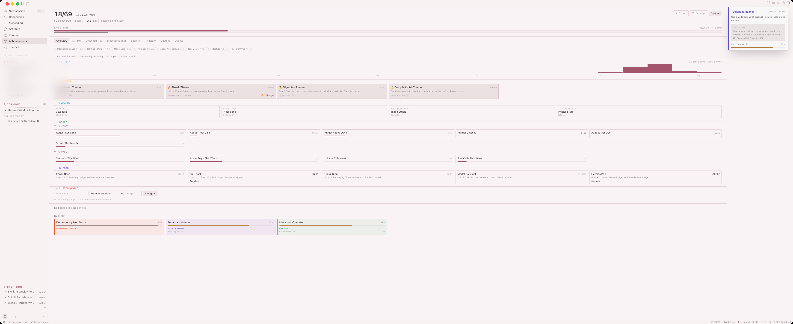
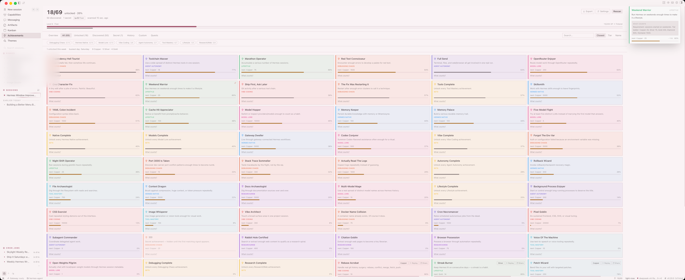

# Hermes Desktop Achievements

Achievements, right inside the Hermes desktop app, with unlock notifications.

A full achievements page (score header, tier filters, progress bars, rescan),
a sidebar nav row, a live statusbar score chip, and a ⌘K command — all backed
by the `hermes-achievements` dashboard plugin that ships with Hermes Agent.




The achievements page is organized into content tabs: **Badges** (the grid
with state filters, search, and sort), **Goals** (monthly/weekly challenges
plus custom goals), **Records** (personal bests and the activity heatmap),
and **Rewards** (unlockable themes), plus Quests and History. The tab bar
stays pinned while you scroll.

## What you get

- **Unlock notifications** — toast, haptic, a chime, and a confetti burst in
  your theme colors plus the badge's tier color, no page visit required
- **Discord announcements** — optional webhook posts every unlock and
  milestone to your server
- **Tier-specific sounds** — Copper/Silver get the chime, Gold and up and
  milestones get a five-note fanfare
- **Score header** — unlocked/total, discovered/secret counts, scan freshness,
  one-click **Rescan**
- **Next up strip** — the locked achievements closest to unlocking, with
  progress bars and next-tier thresholds
- **Unlock history** — a chronological timeline of every unlock with dates and
  evidence sessions
- **Custom achievements** — define your own personal badges, mark them done,
  get the same celebration
- **Settings panel** — toggles for confetti, sound, haptic, and the Discord
  webhook URL, persisted across restarts
- **Milestone celebrations** — a bigger confetti party at every 10 unlocks
- **Weekly mini-stats** — unlocks this week, busiest day, tier counts
- **Level system** — every tier unlock grants XP; a level 1-50 meta-layer with
  names (Initiate → Hermes) never resets, shown in the header with an XP bar
- **Quests** — combo requirements (badges across categories + sets + streaks)
  grant bonus XP
- **Personal records** — best day, busiest day, biggest and longest session,
  always beatable
- **Reward unlock moments** — the watcher celebrates the instant a reward
  theme unlocks, with an install hint
- **Weekly + monthly challenges** — time-boxed goals on two cadences for a
  fast win cycle
- **Nudges** — a whisper when a locked achievement passes 90% (settings-gated)
- **Badge wall export** — the full collection as an SVG poster from Export
- **Collapsible sections** — every strip collapses to a header row with
  state remembered across reloads
- **Quest + goal completion moments** — fanfare and toasts when quests and
  custom goals hit their targets
- **Pin favorites** — pin any badge and it sorts to the top, persisted
- **Tier-colored progress bars** — each bar tints by its next tier
- **Category overview** — clickable color-coded chips show per-category
  completion, and any category label filters the grid
- **Custom metric goals** — define goal-based badges ("500 terminal calls")
  computed by the engine, with live progress bars
- **Session-end recap** — a toast summarizes what a session unlocked once it
  goes idle
- **README badge** — a flat SVG shield (level · unlocks · streak) served by
  the backend for any README
- **Activity heatmap** — a GitHub-style year view of session days and tool
  calls, so your streak and rhythm are visible at a glance
- **Set collections** — finish every achievement in a category to earn a
  trophy set badge (complete all 8 for the Completionist reward)
- **Reward themes** — reach Diamond or Olympian tier, hold a 30-day streak,
  or complete every set to unlock exclusive themes you can install
  straight from the page
- **Streak tracking** — the statusbar chip shows your 🔥 current-day streak,
  and a Streak Burner badge tracks your longest consecutive-day run
- **Next-up ETA** — locked achievements closest to unlocking show an estimate
  of how many days until the next tier at your recent activity pace
- **Export badges** — download the full list as Markdown or JSON
- **Replay celebrations** — fire the confetti again from any unlocked badge or
  history entry
- **Per-session context** — badges earned in the active session, right on the
  page
- **Share cards** — 1200×630 canvas PNG export for any unlocked badge, ready
  to post
- **Content tabs** — Badges / Goals / Records / Rewards / Quests / History;
  the badge grid carries its own state sub-filter (all / unlocked /
  discovered / secret) plus search and sort inside the Badges tab
- **Sticky tab bar** — navigation stays pinned to the top while you scroll
- **Quests tab** — all available quests with requirements, XP, and completion
  dates; a "Recently completed" timeline shows the last 5 quests finished
- **Color-coded sections** — each content tab's sections carry a
  category-palette accent (Activity sky, Rewards gold, Records teal, Goals
  green, Custom goals coral)
- **Search and sort** — filter by name, sort by closest, tier, or name
- **NEW freshness tag** — badges unlocked in the last 48 hours are marked NEW
- **Statusbar chip** — live score plus the closest next-up achievement in the
  tooltip; click to open
- **Command palette** — ⌘K → "Achievements: Open"

## Install

1. **Backend (required):** the Hermes Agent install already ships
   `plugins/hermes-achievements/` (it mounts `/api/plugins/hermes-achievements/`
   on `hermes serve`). Make sure it's enabled in `~/.hermes/config.yaml`:

   ```yaml
   plugins:
     enabled:
       - hermes-achievements
   ```

   Verify it mounted:

   ```bash
   grep "Mounted plugin API routes: /api/plugins/hermes-achievements" ~/.hermes/logs/agent.log
   ```

2. **Desktop plugin:** copy the folder into your desktop plugins directory:

   ```bash
   mkdir -p ~/.hermes/desktop-plugins/hermes-achievements
   cp plugin.js ~/.hermes/desktop-plugins/hermes-achievements/
   ```

3. The app watches that directory — the plugin loads within a few seconds.
   If it doesn't appear: ⌘K → **Reload desktop plugins**.

## Requirements

- Hermes Agent desktop app (v0.19+ recommended)
- The `hermes-achievements` plugin enabled (bundled with Hermes Agent; see
  `plugins/hermes-achievements/` in the repo or the dashboard's built-in
  plugins doc)

## How it works

- **Zero new backend.** The plugin talks to the existing
  `hermes-achievements` dashboard plugin API over `ctx.rest` →
  `/api/plugins/hermes-achievements/achievements` — the same scan engine the
  web dashboard uses.
- **Unlock watcher.** Polls `/achievements` every 15 seconds and diffs against
  a known-unlock set persisted in plugin storage. First load seeds the
  baseline, so restarts never replay old unlocks. New unlocks fire a success
  toast, haptic, and a two-tone chime, then invalidate the shared React Query
  cache.
- **Theme-native.** Cards, chips, and the share card use the app's theme CSS
  variables, no hardcoded colors, follows light/dark.

## Files

```text
plugin.js   The whole plugin — plain ESM, loaded uncompiled (jsx() calls, no JSX syntax)
```

## Development

The desktop plugin SDK docs live in the Hermes Agent repo:
`website/docs/developer-guide/desktop-plugin-sdk.md`.

Quick iteration loop: edit `plugin.js`, save — the app hot-reloads in place.

## License

MIT. Original plugin by [Tony Simons](https://x.com/tonysimons_), extended by
[Cliff Wade](https://github.com/CliffWade) with unlock notifications, next-up
tracking, per-session badges, and share cards.
